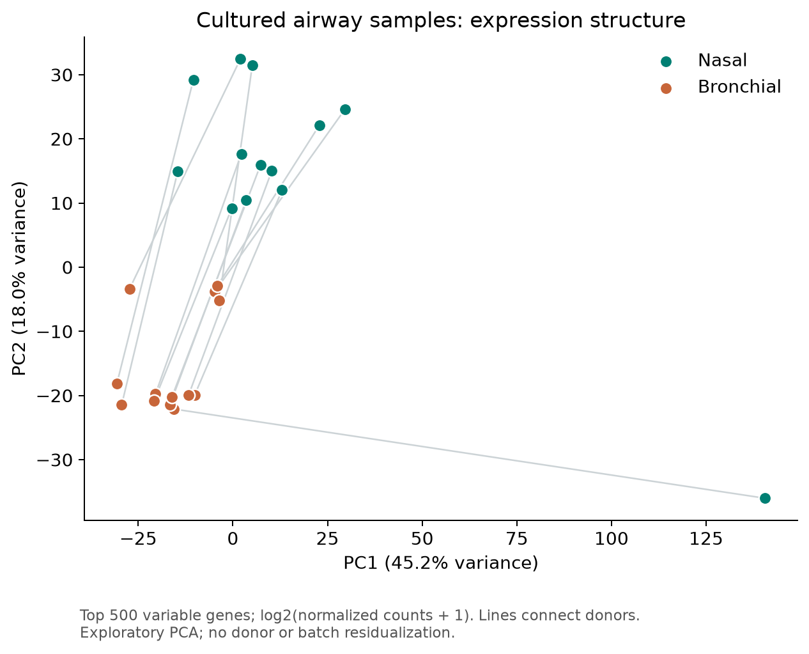
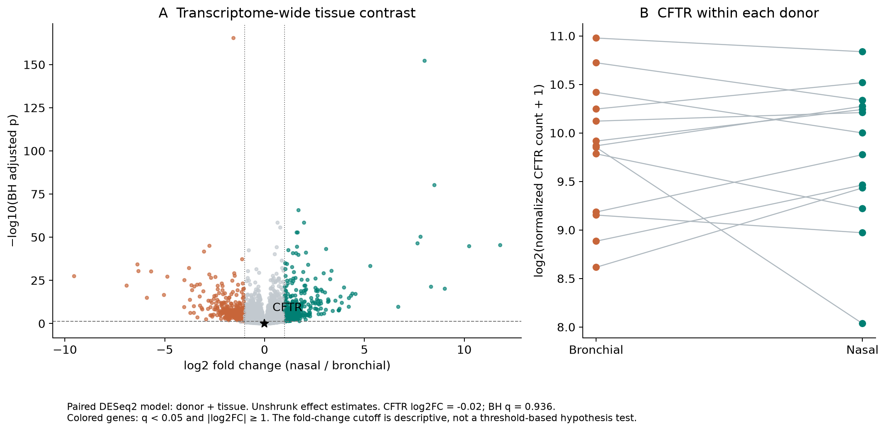
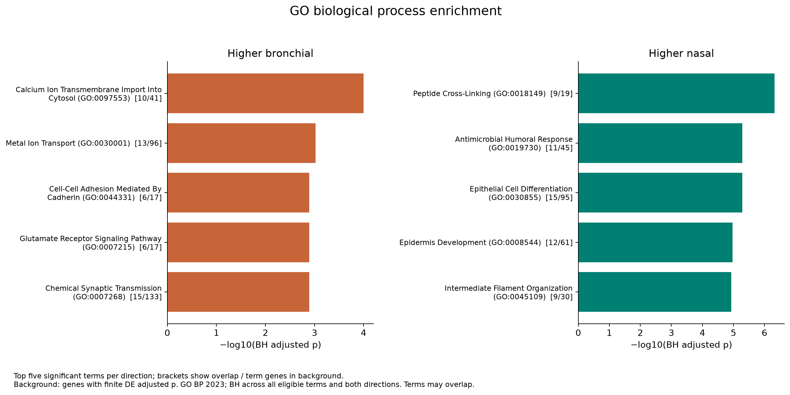

# Transcriptomic Analysis of CFTR-Related Gene Expression

A reproducible Python reanalysis of public airway RNA-seq counts, with a donor-paired PyDESeq2 model, Gene Ontology enrichment, and three figures.

**Question:** How do CFTR and other airway transport or epithelial genes differ between cultured nasal and bronchial samples from the same donors with cystic fibrosis?

**Status:** Executed on 16 September 2026. Results are exploratory and conditional on the documented sample-label mapping. This repository contains computational work only. No CRISPR experiments, sample collection, sequencing, or other laboratory experiments were performed for this project.

## Data and cohort

[GEO GSE172232](https://www.ncbi.nlm.nih.gov/geo/query/acc.cgi?acc=GSE172232) contains 71 samples spanning airway tissue and culture models from 21 people with CF. The accompanying study is [He et al., “Expression of cystic fibrosis lung disease modifier genes in human airway models” (2022)](https://doi.org/10.1016/j.jcf.2022.02.007).

This project uses the deposited **raw gene count matrix**, with 26,363 gene rows. GEO describes STAR alignment to hg19 and HTSeq counting. It does not use the separately supplied TPM matrix and does not redo alignment.

The contrast uses **26 cultured samples from 13 paired donors**. Uppercase B/N count labels are interpreted as cultured bronchial/nasal samples, matching donor identifiers and GEO culture titles; the `_V2` suffix is retained. Lowercase b/n columns are excluded as naive tissue. Numeric sample columns are excluded because their mapping could not be resolved reliably from the downloaded metadata.

**Mapping limitation:** this is an inferred naming convention, not an author-confirmed sample crosswalk. ENA confirms the GEO accessions and descriptions but does not independently resolve the count-column labels. Confirm the crosswalk with the depositors before relying on tissue-specific biological conclusions. Every included mapping is in [samples.tsv](data/processed/samples.tsv); all 71 inclusion/exclusion decisions are in [sample_audit.tsv](data/processed/sample_audit.tsv).

Input URLs and SHA256 hashes are recorded in [data/manifest.json](data/manifest.json). Public source data and the fixed GO BP 2023 snapshot are bundled so analysis can run offline after dependencies are installed.

## Reproduce

Python 3.12 is the tested interpreter. Run from this directory:

```bash
python3.12 -m venv .venv
source .venv/bin/activate
python -m pip install -r requirements.txt
python src/download_data.py
python -m unittest discover -s tests -v
python src/analyze.py
python src/plot_results.py
```

The downloader verifies existing files and retrieves only missing files. Changed upstream resources fail checksum verification. Preserve the bundled snapshot to reproduce this run. The model uses two CPU workers. The GitHub workflow repeats validation and analysis, but has not yet run on GitHub.

## Methods

1. Validate unique identifiers, nonnegative integer counts, identical Gene/Feature annotations, complete donor pairs, and a full-rank design.
2. Retain genes with at least 10 counts in at least 13 of 26 samples: **15,425 genes** remain. This fixed filter removes poorly measured genes.
3. Fit a negative-binomial model with [PyDESeq2 0.5.4](https://pydeseq2.readthedocs.io/en/stable/auto_examples/plot_minimal_pydeseq2_pipeline.html): `~ donor + tissue`. Use median-ratio size factors, dispersion estimation, Cook's filtering, and default eligible outlier refitting. The design has rank 14.
4. Test nasal versus bronchial with Wald tests. Positive log2 fold changes indicate higher nasal expression. Apply Benjamini–Hochberg correction across all 15,425 tested genes; independent filtering is disabled. Report unshrunk estimates and approximate pointwise 95% Wald confidence intervals. Intervals are not simultaneous or corrected for multiple comparisons.
5. Define enrichment hits as adjusted p < 0.05 and absolute log2 fold change ≥ 1, separated by direction. The effect cutoff is descriptive; hypothesis tests test zero effect.
6. Perform one-sided hypergeometric overrepresentation tests against [Enrichr's GO Biological Process 2023 gene sets](https://maayanlab.cloud/Enrichr/). Use all 15,425 genes with finite DE adjusted p as the measured background. Intersect each term with it and retain terms containing 15–500 background genes. Apply BH jointly across **4,328 term-by-direction tests**, including zero-overlap terms. Statistics are computed locally, not with Enrichr's web ranking algorithm.
7. Plot PCA using the 500 most variable genes after log2(normalized counts + 1), a volcano plot with paired CFTR expression, and the top five significant GO terms per direction. PCA is not residualized for donor or batch.

The context panel was selected before inspecting model output: CFTR, SLC26A9, SLC6A14, SCNN1A/B/G, SLC9A3, MUC5AC/B, FOXJ1, KRT5. It mixes transport and epithelial context genes; not all are established CF modifiers. Complete results retain every modeled gene.

## Findings from this run

Results assume the sample-label mapping above is correct.

| Result | Value |
|---|---:|
| Genes tested | 15,425 |
| Genes with BH adjusted p < 0.05 | 6,525 |
| Higher nasal, additionally log2FC ≥ 1 | 350 |
| Higher bronchial, additionally log2FC ≤ −1 | 432 |
| GO term-by-direction tests with BH adjusted p < 0.05 | 49 |

| Gene | log2FC nasal / bronchial | Approximate 95% CI | BH adjusted p |
|---|---:|---|---:|
| CFTR | −0.020 | −0.369 to 0.329 | 0.936 |
| SLC26A9 | −1.883 | −2.710 to −1.056 | 0.0000691 |
| SLC6A14 | 0.679 | 0.273 to 1.086 | 0.00431 |
| MUC5B | −2.109 | −2.829 to −1.388 | 0.000000175 |

CFTR showed no detectable average tissue difference. **A nonsignificant test does not demonstrate equivalence**, and RNA abundance does not measure CFTR channel function. SLC26A9 and MUC5B had lower estimated expression in nasal cultures.

Higher-nasal genes were enriched for peptide cross-linking (q ≈ 4.71 × 10⁻⁷), antimicrobial humoral response, and epithelial cell differentiation. Higher-bronchial genes included enrichment for calcium ion transmembrane import into cytosol (q ≈ 9.94 × 10⁻⁵). Enrichment describes annotation overlap, not demonstrated pathway activation. GO terms share genes, so 49 significant tests are not 49 independent discoveries.







## Limitations and next steps

- The sample crosswalk requires author confirmation. Excluding unresolved labels reduces coverage and can introduce selection bias.
- All donors have CF. No healthy comparison exists here, so this analysis cannot identify CF-versus-healthy effects or effects caused by CFTR mutation.
- The source population includes lung-transplant patients; generalization to early disease or other populations is uncertain.
- Donor effects account for stable individual differences. Unavailable batch, culture, treatment, and cell-composition covariates can still affect the contrast. No samples were removed based on PCA.
- Analysis starts from deposited counts with older hg19 annotations. It does not assess raw reads, realign, or harmonize historical gene aliases to the newer GO snapshot.
- Overrepresentation depends on gene length, expression, annotation coverage, and thresholds. The measured background helps but does not eliminate these biases.
- AWCTX_18N is separated strongly on PC1 (45.2% of plotted variance). It was retained because no independent exclusion criterion was available. A leave-one-donor-out sensitivity analysis is needed to assess its influence.
- Effects are unshrunk; large effects at low counts require caution. No independent validation, sensitivity analysis, equivalence test, or functional assay is included.
- Confirm the crosswalk, then repeat with all resolvable pairs and an independent cohort before drawing substantive biological conclusions.

## Files and validation

- `src/analyze.py`: validation, paired DE, enrichment, output tables.
- `src/plot_results.py`: three figures in PNG and SVG.
- `results/differential_expression.tsv`: all modeled genes, standard errors, p values, and intervals.
- `results/cftr_context_panel.tsv`: complete selected panel.
- `results/go_enrichment.tsv`: every tested term, universe/set/overlap sizes, and overlap genes.
- `results/sample_qc.tsv`, `results/pca_scores.tsv`, `results/summary.json`: audit outputs.
- `tests/test_analysis.py`: invalid counts, duplicates, real cohort pairing, comparison to Fisher's exact test, and empty hit lists.

The full model and figure generation ran successfully. Five tests passed. All three figures were visually inspected. Tests validate computation and internal consistency, not the inferred biological sample identities.

## Attribution

Original data: He and colleagues, GSE172232; this project does not claim authorship of the underlying experiments. Gene sets: Enrichr / Gene Ontology; see [Enrichr citation guidance](https://maayanlab.cloud/Enrichr/) and [Gene Ontology](https://geneontology.org/). Data and annotations retain their respective terms. Reanalysis code is MIT licensed; that license does not relicense third-party data.
